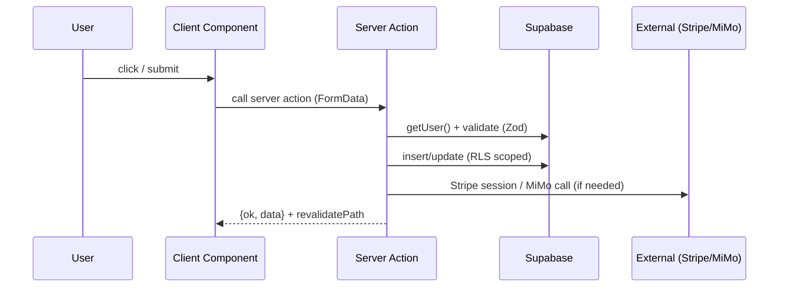
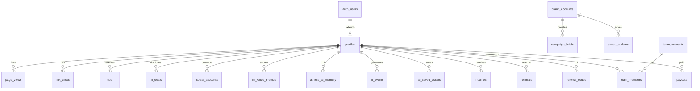

# PROJECT.md — AthleteOS Engineering Reference

> Reverse-engineered **directly from the repository source** (`D:/Projects/AthleteOS-main`). Every claim is derived from code, configuration, migrations, or environment files. Confidence labels (**High** / **Medium** / **Low**) mark inferred vs explicit facts. Assumptions are called out separately from verified facts.
> Supersedes the repo-root `PROJECT.md` (batch draft) and the partial `docs/PROJECT.md` first pass.
> Generated 2026-07-12. Cross-check `docs/` for product context (VISION, CREDENTIALS, AGENTS, etc.).

---

## 1. Executive Summary  ·  *Confidence: High*

- **What is this project?** AthleteOS is a premium, dark-themed **NIL (Name, Image, Likeness) business operating system** for student-athletes. It began as a high-conversion landing page and has scaled into a full platform: athlete profile cards, AI content tools, analytics, tipping via Stripe Connect, memberships, a brand marketplace, compliance tracking, and an admin "god mode" console.
- **Problem it solves:** College/high-school athletes can monetize their NIL but lack tooling to (a) present a brand-ready profile, (b) price themselves, (c) track engagement, (d) accept tips/subscriptions, and (e) stay compliant with school/state rules. AthleteOS consolidates all of these.
- **Users:** *Athletes* (primary — cards, AI tools, analytics, tips), *Fans* (tip/subscribe via public `/[username]`), *Brands* (discover athletes, run campaigns), *Admins* (single hardcoded admin email + `role='admin'` profiles; `/admin` god-mode).
- **Business goals:** Convert free signups → **Pro ($14/mo)** / **Elite ($29/mo)** subscriptions; take a **5% platform fee** on tips; scale a brand marketplace; build a data moat (`athlete_knowledge`, `ai_events`, `athlete_ai_memory`).
- **Core features:** Athlete card, onboarding gate, AI toolkit (bio/captions/pitch/optimizer/rate), NIL Value Engine (score + pricing + deal checker), analytics, tipping + Stripe Connect payouts, memberships, brand marketplace, compliance OS, referrals, teams, admin console, 5 cron-driven jobs.
- **Overall architecture:** Next.js 14 App Router (RSC by default, selective `"use client"`), Supabase (Postgres + Auth + RLS + Storage), Stripe (subscriptions + Connect tips), Resend (email), PostHog (analytics), Sentry (errors), a third-party LLM (**MiMo** via `api.xiaomimimo.com`, referenced as `MIMO_API_KEY` — *not* Gemini), deployed on Vercel with 5 cron jobs.

---

## 2. Technology Stack  ·  *Confidence: High*

| Technology | Purpose | Where used | Advantage | Drawback / Risk |
|---|---|---|---|---|
| TypeScript 5.6 | Type safety | entire codebase | catches errors pre-runtime | build-time cost |
| Next.js 14.2 (App Router) | SSR/RSC, routing, API routes, OG gen | `app/`, `next.config.mjs` | RSC, streaming, middleware, edge | large surface |
| React 18.3 | UI | `app/`, `components/` | ecosystem | `"use client"` boundary mgmt |
| Tailwind CSS 3.4 | Styling (dark-only, single accent `#C6FF3D`) | `tailwind.config.ts`, all components | fast, consistent tokens | verbose class strings |
| Framer Motion 11 | Animations | `components/motion/*`, many `*.tsx` | rich motion | client-only bundle |
| Lenis 1.1 | Smooth scroll | `components/smooth-scroll.tsx` | premium feel | jank on low-end |
| lucide-react | Icons | everywhere | tree-shakeable | — |
| clsx + tailwind-merge | className composition | `lib/utils.ts` (`cn`) | safe merges | — |
| @supabase/ssr + supabase-js 2.1 | Auth + DB + Storage | `lib/supabase/*`, server actions | RLS, SSR cookies | service-role key mgmt |
| Stripe 22 | Subscriptions + Connect tips/payouts | `lib/stripe*.ts`, `app/api/stripe/*` | payments infra | webhook complexity |
| Resend 6 | Transactional email | `lib/resend.ts`, `lib/actions/emails.ts` | simple API | deliverability |
| PostHog JS 1.39 | Product analytics | `components/providers/posthog-provider.tsx` | funnels, autocapture | privacy (opt-out only) |
| Sentry (@sentry/nextjs 10) | Errors + perf | `instrumentation.ts`, `sentry.*.config.ts` | traces, replays | cost; sourcemaps hidden |
| @google/generative-ai | **Declared but UNUSED** | — | — | **dead dependency** (see §8, §28) |
| Zod 3.23 | Runtime validation of inputs/DB writes | 20 `lib/actions/*.ts` | safe parsing | — |
| @vercel/og 0.11 | Dynamic OG images | `app/api/og/[username]/route.tsx` | branded shares | server compute |
| canvas-confetti + qrcode | Celebration + QR share | dashboard components | UX polish | — |
| Jest 30 + Testing Library | Unit tests | `__tests__/` (2 files) | — | only 2 unit tests exist |
| Playwright 1.48 | E2E | `e2e/` (3 specs, 122 tests) | full-flow coverage | runs vs **live prod** (risk) |
| ESLint 8 (next/core-web-vitals) | Lint | `.eslintrc.json` | — | minimal ruleset |
| sharp | Image optimization | `next.config.mjs`, `scripts/gen-og.js` | fast resize | native dep |
| Vercel | Host + CI cron | `vercel.json`, `.github/workflows/ci.yml` | zero-config | vendor lock-in |
| GitHub Actions | CI (lint+build) | `.github/workflows/ci.yml` | — | no test/e2e gate |
| **MiMo API** (`api.xiaomimimo.com`) | LLM for ALL AI features | `lib/ai.ts` (`MIMO_API_KEY`, `MIMO_MODEL`) | metered AI | **undocumented vendor; not in package.json** |

---

## 3. Project Philosophy  ·  *Confidence: High (inferred from code + AGENTS.md)*

- **Design:** Dark-only, single accent `#C6FF3D` (electric lime), no second accent, no light mode, no emojis in code/copy. Premium, conversion-focused.
- **Coding:** Server Components by default; `"use client"` only when hooks/effects/handlers/Framer Motion required. Smallest possible change. (127/201 `.tsx` are client — most interactive UI.)
- **Architecture:** Vertical slices (feature → page + components + server actions). Supabase as the single backend. Server actions for mutations; route handlers for webhooks/OAuth/cron.
- **Folder:** `app/` (routes), `components/` (UI by domain), `lib/actions/` (server actions by domain), `lib/supabase/` (3 clients), `lib/` (utilities), `supabase/migrations/` (SQL), `config/` (nav).
- **State:** **No Redux/Zustand/Context global store** (*High — confirmed by repo-wide grep*). Server Components fetch via Supabase; client components use local `useState` + 3 custom hooks + server actions; Supabase realtime is **not** used (the "RealtimeDashboard" actually polls on a 15s interval).
- **Error handling:** try/catch with `console.error` + user-safe messages; server actions return `{ ok, error }` envelopes; webhooks log to `audit_log` and are idempotent.
- **Security:** RLS on every table; `getUser()` (not `getSession()`) in server components; Zod-validate DB writes; service-role key server-side only; CSP + security headers; cron guarded by `CRON_SECRET`; IP hashing for analytics.
- **Performance:** `dynamic(() => ..., { ssr:false })` for landing sections (13 of them); `next/image` with supabase remotePatterns; long Cache-Control on static/fonts; `no-store` on `/api`.
- **Scalability:** Supabase serverless Postgres + RLS; cron batch jobs; service-role bypass of RLS for analytics.
- **Maintainability:** Heavy reliance on `lib/actions/*`; mega-components (`sponsorship-marketplace.tsx` 1541 LOC). Docs-everything rule (AGENTS.md).
- **Developer Experience:** `npm run lint/build/test/test:e2e/gen:og`; Playwright prod audit; Sentry tunnel.

---

## 4. Architecture

### Frontend
- Root layout (`app/layout.tsx`): Inter font, dark `<html>`, JSON-LD orgs, `PostHogProvider` → `SmoothScroll` → children, plus `CookieConsent` and `ServiceWorkerRegistration`.
- Landing (`app/page.tsx`): 14 sections; **13 loaded via `next/dynamic({ ssr:false })`, 3 stay SSR** (AnnouncementBar/Navbar/Hero).
- Dashboard/authed areas: Server Components fetch profiles; client components handle interaction.

### Backend
- **Supabase** is the backend: Postgres (RLS), Auth (email/password + Google OAuth + Instagram/TikTok social connect), Storage (`avatars`/`covers`/`content-media` buckets).
- **Server Actions** (`lib/actions/*.ts`, `"use server"`) perform mutations; they call `createClient()` (anon, cookie-bound) for auth and `createServiceClient()` (service role) for privileged/analytics queries.
- **Route Handlers** (`app/api/**`) for: Stripe webhook, OAuth callbacks, cron jobs, admin API, OG image, social refresh, waitlist/confirm, analytics reports.

### Rendering / Routing / Caching
- App Router with `force-dynamic` on public profile (`/[username]`) and admin pages.
- Middleware (`middleware.ts`) gates `/dashboard`, `/onboarding`, `/teams`, `/brands`, `/admin` by auth + `onboarding_completed` + `suspended` + admin allowlist. API routes are bypassed (`if (pathname.startsWith("/api/")) return next()`).
- Caching: immutable 1y for `/fonts` + `/_next/static`; 1d `stale-while-revalidate` for images; `no-store` for `/api`.

### Request / Data / Auth lifecycle
```mermaid
flowchart TD
  U[User] -->|HTTPS| MW[Next.js Middleware]
  MW -->|no session + protected| SI[/auth/sign-in]
  MW -->|suspended| SUS[/suspended]
  MW -->|incomplete + not onboarding| OB[/onboarding]
  MW -->|admin path| ADM{isAdmin?}
  MW -->|ok| R[Route / Server Component]
  R --> SC[Supabase anon client getUser]
  R --> SR[Supabase service role for analytics/admin]
  R --> EXT[Stripe / Resend / PostHog / MiMo]
```



```mermaid
flowchart LR
  A[Email/Password or Google] -->|Supabase Auth| B[Session cookie]
  B --> C[Middleware reads cookie]
  C --> D{authorized?}
  D -->|admin email or role=admin| E[/admin god-mode]
  D -->|athlete| F[/dashboard]
  G[Instagram/TikTok OAuth] -->|connect| H[Store social_accounts + token]
```

---

## 5. Folder Structure  ·  *Confidence: High*

```text
AthleteOS/
├── app/                         # Routes (App Router)
│   ├── [username]/              # Public athlete card (force-dynamic, SEO)
│   ├── about/ about page
│   ├── admin/                   # God-mode admin console (CRITICAL)
│   ├── api/                     # Route handlers (18 files)
│   │   ├── admin/[...adminPath] # Admin REST API (Zod-validated) (CRITICAL)
│   │   ├── analytics-report/[token]
│   │   ├── auth/                # confirm-email, profile-status
│   │   ├── confirm-waitlist/
│   │   ├── cron/                # 5 Vercel cron endpoints (CRON_SECRET)
│   │   ├── og/[username]        # Dynamic OG image (@vercel/og)
│   │   ├── social/              # instagram/tiktok connect+callback, refresh
│   │   ├── stripe/              # webhook (signature-verified), diagnose
│   │   └── waitlist/
│   ├── auth/                    # sign-in/up, forgot/reset, callback, welcome, error
│   ├── brands/                  # brand dashboard/discover/setup
│   ├── changelog/ feedback/ legal/ docs/
│   ├── dashboard/               # 14 sub-routes (ai, analytics, billing, ...)
│   ├── discover/ fan/ teams/ onboarding/ r/[code]/ stripe/ suspended/ offline/
│   ├── layout.tsx global-error.tsx loading.tsx not-found.tsx
│   ├── robots.ts sitemap.ts     # SEO
├── components/                  # UI (114 .tsx/.ts files)
│   ├── admin/ god-mode/         # admin UI + god-mode subapp (20 panels)
│   ├── dashboard/               # ~50 dashboard feature components
│   ├── layout/ motion/ mobile/ onboarding/ providers/ ui/
│   └── *.tsx                    # landing + shared components
├── lib/
│   ├── actions/                 # 37 server actions (by domain)
│   ├── hooks/                   # 3 hooks (use-ab-test, use-funnel-tracking, use-stream)
│   ├── supabase/                # client.ts (browser/anon), server.ts, middleware.ts
│   ├── admin.ts isAdmin() email allowlist (CRITICAL)
│   ├── ai.ts MiMo API caller + prompt builders (CRITICAL)
│   ├── constants.ts stripe-billing.ts stripe.ts resend.ts
│   ├── nil-score.ts profile-score.ts content-storage.ts storage.ts
│   ├── display-name.ts sport-stat-templates.ts utils.ts
├── config/dashboard-nav.ts      # nav definition (CONFIG)
├── docs/                        # 27+ project docs (existing)
├── e2e/                         # 3 Playwright specs (122 tests)
├── __tests__/                   # 2 Jest unit tests
├── scripts/gen-og.js            # OG image generator (sharp; @vercel/og broken on Windows)
├── supabase/
│   ├── migrations/              # 35 SQL migrations
│   ├── schema.sql               # regenerated schema (STALE/partial — see §11)
│   └── APPLY_MIGRATIONS.sql
├── public/                      # static assets
├── middleware.ts                # auth/onboarding/suspended/admin guard (CRITICAL)
├── next.config.mjs tailwind.config.ts vercel.json instrumentation.ts
├── sentry.*.config.ts jest.config.js playwright.config.js playwright.prod.ts
├── .env.example env .env.local  # env (env/.env.local GIT-IGNORED)
├── AGENTS.md README.md NIL.md athleteos-complete-blueprint.md
```

**Marks:** CRITICAL = `middleware.ts`, `app/api/stripe/webhook`, `app/api/admin/*`, `lib/admin.ts`, `lib/ai.ts`, `supabase/migrations`, `app/[username]`, `.env*`. Optional/Generated = `graphify-out/`, `.kilo/`, `.next/`, `playwright-report/`, `tsconfig.tsbuildinfo`. Configuration = all `*.config.*`, `vercel.json`, `middleware.ts`.

---

## 6. Configuration  ·  *Confidence: High*

- **package.json** — scripts: `dev/build/start/lint/test/test:e2e/gen:og`. Deps as in §2.
- **tsconfig.json** — `strict: true`, `paths: { "@/*": ["./*"] }`, `moduleResolution: bundler`, excludes `athleteos-god-mode`.
- **next.config.mjs** — `reactStrictMode`, security headers (HSTS, X-Frame-Options DENY, CSP, Permissions-Policy), `images.remotePatterns` supabase, `optimizePackageImports` for lucide/framer, `withSentryConfig` (tunnel `/api/sentry`), dev-only `config.cache=false` (workaround for Sentry-serialized chunk corruption; commented "ponytail").
- **tailwind.config.ts** — dark class, custom color tokens (`bg`, `line`, `ink`, `accent`), fluid display type scale, keyframes/animations.
- **vercel.json** — `buildCommand npm run build`, `installCommand npm install`, **5 crons** (weekly-briefing Mon 8:00 UTC, prune-analytics Sun 3:00 UTC, profile-nudge daily 12:00 UTC, card-digest Mon 10:00 UTC, scheduled-reports daily 9:00 UTC).
- **middleware.ts** — matcher excludes `_next/static`, `api/stripe/webhook`, static assets.
- **instrumentation.ts + sentry.*.config.ts** — Sentry init, production-only, `tracesSampleRate 0.1`.
- **jest.config.js** — next/jest, jsdom, `@/` alias. **playwright.config.js** (local dev server) + **playwright.prod.ts** (live `https://athlete-os-vert.vercel.app`).
- **.eslintrc.json** — `extends next/core-web-vitals` only.
- **postcss.config.mjs** — tailwind + autoprefixer.
- **.github/workflows/ci.yml** — on push/PR to main/develop: `npm ci`, `npm run lint`, `npm run build` (no test/e2e step). `STRIPE_SECRET_KEY` fallback is a **placeholder string** (not a real secret ref) — build runs with a bogus key if real secret unset.

---

## 7. Environment Variables  ·  *Confidence: High (verified via grep + .env.example)*

| Variable | Purpose | Required | Default | Used in | Risk |
|---|---|---|---|---|---|
| `NEXT_PUBLIC_SUPABASE_URL` | Supabase project URL | Yes | — | everywhere | Low (public) |
| `NEXT_PUBLIC_SUPABASE_ANON_KEY` | Supabase anon key | Yes | — | client + server | Low (RLS-scoped) |
| `SUPABASE_SERVICE_ROLE_KEY` | Privileged DB access | Yes (server) | — | ~50 server files | **Critical if leaked** — server-only |
| `RESEND_API_KEY` | Email sending | Yes | — | `lib/resend.ts` | Medium |
| `NEXT_PUBLIC_SITE_URL` | OAuth/email redirects | Yes | localhost:3000 | auth, stripe | Low |
| `STRIPE_SECRET_KEY` | Stripe API | Yes | — | `lib/stripe.ts`, webhook | **Critical** |
| `NEXT_PUBLIC_STRIPE_PUBLISHABLE_KEY` | Stripe publishable | Yes | — | checkout client | Low (public) |
| `STRIPE_WEBHOOK_SECRET` | Webhook HMAC | Yes | — | `app/api/stripe/webhook` | Critical |
| `STRIPE_PRICE_ID_PRO` / `_ELITE` | Plan price IDs | Yes | — | webhook, billing | Medium |
| `GEMINI_API_KEY` | **Unused** (AI uses MiMo) | No | — | — | Confusing/dead |
| `GEMINI_MODEL` | **Unused** | No | — | — | Confusing/dead |
| `MIMO_API_KEY` | LLM API key (actual AI) | Yes | — | `lib/ai.ts` | **Critical** (undocumented vendor) |
| `MIMO_MODEL` | LLM model | No | mimo-v2.5-pro | `lib/ai.ts` | Low |
| `NEXT_PUBLIC_POSTHOG_KEY` | PostHog project | No | — | posthog-provider | Low (public) |
| `NEXT_PUBLIC_POSTHOG_HOST` | PostHog host | No | us.i.posthog.com | posthog-provider | **Low — NOT in .env.example** |
| `NEXT_PUBLIC_SENTRY_DSN` | Sentry DSN | No | — | sentry config | Low (public) |
| `SENTRY_ORG` / `SENTRY_PROJECT` | Sentry config | No | — | `withSentryConfig` | Low |
| `ANALYTICS_IP_HASH_SECRET` | HMAC secret for IP hashing | Yes | — | analytics insert | **Critical — insecure fallback if unset (hashing disabled, continues)** |
| `CRON_SECRET` | Cron auth (Bearer) | Yes | — | 5 cron routes | Critical (fail-closed) |
| `TIKTOK_CLIENT_KEY` / `TIKTOK_CLIENT_SECRET` | TikTok OAuth | No | — | `app/api/social/tiktok/*` | Medium |
| `INSTAGRAM_APP_ID` / `INSTAGRAM_APP_SECRET` | Instagram OAuth | No | — | `app/api/social/instagram/*` | Medium |

> **Security note (verified):** `.env.local` and `env` are present on disk but **git-ignored** (`git check-ignore` confirms) → not committed to VCS. However, the local `env` file contains **live Stripe live-mode keys + service-role key** — local-machine exposure risk only. `.env.example` is committed with placeholders only. *(High.)*

---

## 8. Dependencies  ·  *Confidence: High*

See §2 for the full table. Notable findings:

| Dependency | Criticality | Notes |
|---|---|---|
| `@google/generative-ai` | Low | **Declared but unused.** All AI calls go through `lib/ai.ts` → `api.xiaomimimo.com` via `MIMO_API_KEY`. Safe to remove; `GEMINI_*` env vars are misleading/dead. |
| `stripe` | Critical | Subscriptions + Connect. API version pinned `2026-06-24.dahlia` (set in `lib/stripe.ts`, `app/api/stripe/webhook/route.ts`, `app/api/stripe/diagnose/route.ts`). |
| `@supabase/ssr` + `supabase-js` | Critical | Core backend. |
| `framer-motion` | Medium | Client-only; large. Used widely. |
| `zod` | High | Input validation in 20 action files. |
| `posthog-js` | Medium | Loaded unconditionally if key present; opt-out via cookie consent. |
| `@vercel/og` | Low | OG images only; `@vercel/og` is broken on Windows so `scripts/gen-og.js` uses `sharp` instead. |
| `qrcode` / `canvas-confetti` | Low | UX polish. |
| `lenis` | Low | Smooth scroll. |

No unused heavy dependencies beyond `@google/generative-ai`. No safe-to-remove runtime dep that breaks features.

---

## 9. Feature Inventory  ·  *Confidence: High (from `lib/actions/*`, 37 files)*

The product surface is exposed via **server actions** (`"use server"` functions) and a smaller set of **HTTP route handlers** (`app/api/**`).

### 9.1 Auth & Accounts
- `auth.ts` — Email/password signup, signin, Google OAuth, signout, password reset/update, confirmation-email issuance + resend (`confirmation_token` on `profiles`, link to `/api/auth/confirm-email`).
- `profile.ts` — CRUD: `getMyProfile`, `getPublicProfile`, `updateProfile` (Zod, change-tracked), `checkUsername`, `updateTheme`. Canonical `Profile` type.
- `gdpr.ts` — `exportUserData` (DSAR) and `deleteAccount` (erasure — **incomplete coverage, §16/§19**).
- `first-500-pro.ts` — Launch promo: free Pro for early users + expiry check.

### 9.2 Profile Builder & Publishing
- `profile.ts`, `social-accounts.ts` (manual CRUD + follower refresh), `profile-history.ts` (per-field change log).

### 9.3 Billing, Payouts & Stripe
- `stripe.ts` — `createTipSession` (tip checkout w/ 5% platform fee split), `createConnectOnboarding` (Express onboarding), `getPayoutBalance`.
- `billing.ts` — `createCheckoutSessionAction`, `createPortalSessionAction`, `cancelSubscriptionAction`, `getSubscriptionStatus`.
- `balance.ts` — `getBalanceSummary`, `getPayoutHistory`, `createPayout` (≥$25).
- `stripe-status.ts`, `tips.ts` (`getTipEarnings`).

### 9.4 NIL Value Engine & Analytics
- `nil-engine.ts` — `computeAndSaveMetrics`, `getNilMetrics`, `runNilValueEngine`, `checkDeal`, `getNilScoreHistory`. **engagement_rate is a hardcoded 0.05 placeholder.**
- `analytics.ts` — `trackView`, `trackLinkClick`, `generateShareableReport`, scheduled reports, `getAnalytics`.
- `realtime-metrics.ts`, `weekly-snapshot.ts`, `discovery.ts`, `milestones.ts`.

### 9.5 AI Toolkit
- `ai.ts` (bio/pitch/caption/optimizer/rate + streaming), `ai-content.ts`, `quick-ai.ts`, `ai-vault.ts` (saved assets), `ai-memory.ts`, `ai-usage.ts` (plan quota), `athlete-knowledge.ts`.

### 9.6 Teams & Collaboration
- `teams.ts` — full workspace: create, members, roles, invites, analytics, messaging, content, tasks, events, announcements (~30 functions).

### 9.7 Memberships & Fan Subscriptions — REMOVED 2026-08-05 (ADR-043)
- ~~`memberships.ts` — tiers + content posts + subscriber counts + `createSubscriptionCheckout`. `memberships-client.ts` (fan-side tier lookup).~~ Deleted pre-MVP. Fan monetization = one-tap tips only.

### 9.8 Brands & Campaigns
- `brand.ts` (brand accounts + scouting), `compliance.ts` (NIL deal disclosure), `inquiries.ts` (brand→athlete inquiries), `schedule.ts` (social scheduler). ~~`campaigns.ts` (athlete email campaigns)~~ — deleted 2026-08-05.

### 9.9 Referrals & Waitlist
- `referrals.ts` (codes, stats, reward), `waitlist.ts` (join/confirm/newsletter).

### 9.10 Admin
- `admin.ts` — users, audit logs, payouts, abuse stats, moderation, `logAdminAction`. `admin-api-client.ts` (`supabaseApi` helper).

### 9.11 Emails
- `emails.ts` — 10 senders (confirmation, weekly briefing, payment failed, welcome, card published, inquiry, tip received, nudge, card-strength digest).

### 9.12 UI → Feature Map
| Feature | Primary Components | Supporting |
|---|---|---|
| Public athlete card | `ProfileCard`, `ProfileCardSkeleton` | `PhotoGallery`, `CardSection`+primitives, `ShareButtons`, `QrShareModal`, `TipButton`, `InquiryForm` |
| Tipping | `TipButton`, `TipEarnings`, `BalanceOverview`, `PaymentMethodSetup`, `BillingPanel` | `Skeleton*`, `Magnetic` |
| Brand inquiries | `InquiryForm`, `InquiryInbox` | `EmptyState` |
| Sponsorship marketplace | `SponsorshipMarketplace` (**1541 LOC, all MOCK data — prototype, not live-backed**) | `LiveWaitlistCount`, `Counter` |
| NIL scoring & compliance | `NilScoreCard`, `NilScoreHistory`, `NilRateTable`, `NilAiBreakdown`, `NilDealChecker`, `NilMetricsStrip`, `SocialAccountsEditor` | `SmartAiActions` |
| AI toolkit | `AIToolkit` + 6 tools + `AiAssetVault` | `Skeleton*`, `SmartAiActions` |
| Analytics | `AnalyticsPanel`, `TodaysDigest`, `DashboardOverview` | `SmartAiActions`, `NilMetricsStrip` |
| Memberships | `MembershipTiers`, `ContentPosts` | `Skeleton*` |
| Social scheduling | `SocialScheduler` | `SocialAccountsEditor` |
| Email campaigns | `EmailCampaigns` | — |
| Profile/settings | `DashboardEditor`, `SettingsPanel`, `ThemePicker`, `DashboardAvatar` | `AvatarUpload`, `CoverImageUpload` |
| Referrals | `ReferralCard` | `ShareButtons` |
| Onboarding | `WelcomeModal`, `LaunchChecklist` | `Logo`, `VerificationBanner` |
| Admin/god-mode | `AdminShell`, `UserTable`, `god-mode/*` (9 panels) | `Skeleton*`, `EmptyState` |
| Marketing | `Hero`, `Problem`, `Solution`, `Features`, `HowItWorks`, `AIFeatures`, `Monetization`, `Pricing`, `FAQ`, `FinalCTA`, `Navbar`, `Footer` | `Reveal*`, `Tilt`, `Magnetic`, `Spotlight`, `Counter`, `TypingText`, `SocialProofAvatars`, `LiveWaitlistCount` |

---

## 10. API Documentation  ·  *Confidence: High (read all `app/api/**`)*

Auth legend: **Anon** = no auth; **Auth** = session cookie; **Admin** = session + `isAdmin(email)`/`role='admin'`; **CRON_SECRET** = `Authorization: Bearer`; **Service** = uses `SUPABASE_SERVICE_ROLE_KEY`.

### 10.1 Endpoint summary
| Path | Method | Auth | Purpose |
|---|---|---|---|
| `/api/waitlist` | GET | Anon | Waitlist + newsletter counts |
| `/api/confirm-waitlist` | GET | Anon (+IP rate limit 5/min) | Confirm waitlist email via `?token=` |
| `/api/auth/confirm-email` | GET | Service | Confirm user email via `?token=` (+IP rate limit) |
| `/api/auth/profile-status` | GET | Auth | `onboardingCompleted` + `isAdmin` |
| `/api/stripe/diagnose` | GET | Admin | Stripe env/subscription/webhook diagnostics |
| `/api/stripe/webhook` | POST | Service (Stripe signature) | Webhook events (8 allowed types) |
| `/api/analytics-report/[token]` | GET | Anon (token) | Shared analytics report |
| `/api/og/[username]` | GET | Anon (Edge) | Dynamic OG image |
| `/api/social/instagram/connect` | GET | Auth | Begin Instagram OAuth |
| `/api/social/instagram/callback` | GET | Service | IG OAuth callback → upsert `social_accounts` |
| `/api/social/tiktok/connect` | GET | Auth | Begin TikTok OAuth |
| `/api/social/tiktok/callback` | GET | Service | TikTok OAuth callback → upsert |
| `/api/social/refresh` | POST | Auth | Refresh follower count |
| `/api/admin/[...adminPath]` | GET/PATCH | Admin | Profiles, financials, compliance, usage, analytics, security, audit, health (+3 PATCH) |
| `/api/cron/weekly-briefing` | GET | CRON_SECRET | Mon 8AM: AI weekly briefing emails |
| `/api/cron/prune-analytics` | GET | CRON_SECRET | Sun 3AM: prune raw analytics (>90d) |
| `/api/cron/profile-nudge` | GET | CRON_SECRET | Nudge incomplete profiles |
| `/api/cron/card-digest` | GET | CRON_SECRET | NIL card-strength digest emails (≥14d) |
| `/api/cron/scheduled-reports` | GET | CRON_SECRET | Send scheduled analytics reports |

### 10.2 Notable logic
- **Stripe webhook:** `STRIPE_WEBHOOK_SECRET` must be set (500 if missing); HMAC verified over raw `request.text()` (edge-stable). ALLOWED: `checkout.session.completed`, `customer.subscription.created/updated/deleted`, `invoice.payment_failed`, `account.updated`, `payout.paid`, `payout.failed`. Idempotent tip inserts (handles 23505 race). `revalidatePath('/dashboard','/dashboard/billing')` on plan change. Every event → `audit_log`.
- **Admin API:** `verifyAdminAuth()` → `isAdmin(email)` OR `profiles.role='admin'`. 9 GET + 3 PATCH sub-routes; Zod-validated; UUID-format validated; falls back to in-process mock data if DB unavailable. Writes `audit_log`.
- **Cron:** identical guard `if (!cronSecret || authHeader !== 'Bearer ${cronSecret}')` → 401. weekly-briefing + card-digest call MiMo (`callGemini`) for AI action items.
- **Rate limiting:** only the two confirmation endpoints implement in-memory IP rate limiting (5/min).

---

## 11. Database Documentation  ·  *Confidence: High (from 35 migrations + schema.sql + lib/app grep)*

### 11.0 Effective-schema caveats (READ FIRST)
- `schema.sql` header says *"Last regenerated: 2026-06-17"* but contains tables up to 2026-07-11 **and omits 9 tables** that exist only in migrations. **The header date is stale; the file is incomplete.**
- `APPLY_MIGRATIONS.sql` is also incomplete (missing `payouts`, `athlete_knowledge`, `nil_score_history`, `scheduled_posts`, `profile_events`, `weekly_snapshots`, `milestones`, `team_messages/*`, etc.).
- Migrations applied in filename (date) order; many `CREATE TABLE IF NOT EXISTS` repeated — first physical creation wins.
- **No native Postgres `ENUM` types** — all enums are `TEXT` + `CHECK` constraints.

### 11.1 Tables referenced in code but MISSING from `schema.sql` (exist in migrations, High)
`tips`, `payouts`, `team_members`, `team_accounts`, `inquiries`, `milestones`, `athlete_knowledge`, `campaign_briefs`. `email_preferences` is a **column on `profiles`**, not a table. ~~`fan_subscriptions`, `membership_tiers`~~ — no longer referenced in code (removed 2026-08-05).

### 11.2 Tables referenced in code with NO migration / NO schema — WILL ERROR AT RUNTIME (Low)
`team_messages`, `team_content`, `team_tasks`, `team_events`, `team_announcements` (all in `teams.ts`). **These have no DDL anywhere** — production calls will raise "relation does not exist". ~~`email_campaigns`, `fan_subscribers` (both in `campaigns.ts`)~~ — source deleted 2026-08-05, no longer referenced.

### 11.3 Core tables (High)
- **profiles** — PK=auth.users(id). 40+ columns (email, full_name, username UNIQUE, sport, school, class_year, position, bio, stats/links/social/highlights JSONB, plan, stripe_*, role, suspended, onboarding_completed, profile_published, email_confirmed, confirmation_token, theme_accent DEFAULT '#C6FF3D', email_preferences JSONB, etc.). RLS: self + public-published + admin.
- **waitlist / newsletter** — email UNIQUE; RLS on, no policies (service-role reads).
- **ai_usage** — `(user_id, tool, period_start)` unique; quota per plan (free=5/pro=300/elite=500).
- **page_views / link_clicks** — FK athlete_id; `viewer_ip_hash` (HMAC). **Anon INSERT enabled (WITH CHECK true).**
- **audit_log** — **immutable** (RLS RESTRICT + BEFORE UPDATE/DELETE triggers). Model for the rest of the schema.
- **referral_codes / referrals** — referral reward `REWARD_DAYS=7`.
- **nil_deals** — `deal_value` INTEGER **cents**; status pending/cleared/rejected (compensation_type has comment-only, no CHECK).
- **social_accounts** — stores OAuth `access_token` (IG/TikTok); unique `(profile_id, platform)`.
- **nil_value_metrics** — unique `(profile_id, period_start, period_end)`; `tips_amount` NUMERIC **dollars**.
- **athlete_ai_memory / ai_events / ai_saved_assets** — AI data moat; `ai_saved_assets.tool_type` has CHECK enum.
- ~~**fan_subscriptions / membership_tiers / content_posts** — membership + members-only content.~~ Removed 2026-08-05 (ADR-043); tables orphaned in DB, unused.
- **brand_accounts / campaign_briefs / saved_athletes / inquiries** — brand side.
- **team_accounts / team_members / team_invites** — teams (role CHECK admin/coach/athlete).
- **profile_events / weekly_snapshots / milestones / payouts / athlete_knowledge / nil_score_history / scheduled_posts** — data-moat + analytics + scheduler.

### 11.4 Functions
| Function | SECURITY DEFINER | search_path set? |
|---|---|---|
| `handle_new_user()` | YES | **NO ⚠️** (search-path hijack risk) |
| `cleanup_rate_limits()` | YES | **NO ⚠️** |
| `grant_pro_reward(UUID)` | YES | **NO ⚠️** (also PUBLIC EXECUTE) |
| `is_admin()` | YES | YES (hardened) |
| `audit_log_immutable()` | YES | YES |
| `cleanup_raw_analytics()` | YES | YES |
| `generate_referral_code()` | NO | n/a |

### 11.5 ER relationships (High)

External (used in code, undefined): `team_messages`, `team_content`, `team_tasks`, `team_events`, `team_announcements`. ~~`email_campaigns`, `fan_subscribers`~~ — source deleted 2026-08-05.
~~`membership_tiers`/`fan_subscriptions`/`content_posts` edges removed from ERD 2026-08-05 (ADR-043); tables remain in DB, orphaned.~~

---

## 12. Authentication  ·  *Confidence: High (verified)*

- **Login:** email/password (`signInWithPassword`) + Google OAuth. `lib/actions/auth.ts`.
- **Registration:** `signUp` (Zod email + password ≥6). Profile auto-created via `handle_new_user()` trigger OR upserted with `confirmation_token`.
- **Email confirmation:** custom token flow (`/api/auth/confirm-email`); `email_confirmed` flag; middleware/admin respect it. `resendConfirmationEmail` supported.
- **Sessions:** Supabase Auth cookies; `getUser()` (not `getSession()`) in server components — matches AGENTS.md rule 4.
- **Password reset:** `resetPasswordForEmail` → `/auth/reset-password` (Zod ≥6).
- **OAuth social connect:** Instagram (Facebook Graph) + TikTok; stores `access_token` in `social_accounts`. `state = user.id` (bound to session user; not a random nonce — Low risk).
- **Permissions / RBAC:** two-layer — (1) `lib/admin.ts` `isAdmin(email)` hardcoded allowlist `sameer@athleteos.app`; (2) `profiles.role = 'admin'` + SQL `is_admin()`. `middleware.ts` redirects non-admins from `/admin`. `suspended` → `/suspended`. `onboarding_completed` gates dashboard.
- **Security:** No manual JWTs (Supabase manages). Referral cookie `httpOnly:false` (acceptable for attribution).

---

## 13. UI Documentation  ·  *Confidence: High (114 component files read)*

### 13.1 Layouts
- `Sidebar` (desktop dashboard nav), `Header` (top bar), `BottomNav` (mobile), `Navbar` (marketing, A/B test + haptics), `Footer`, `Logo` (Server), `SmoothScroll` (Lenis, reduced-motion aware), `AnnouncementBar`, `InstallBanner`, `AdminShell` (god-mode).
- No `components/layout/root` — root layout is `app/layout.tsx`.

### 13.2 Components by folder
- **dashboard/** (~50): `DashboardOverview` (624L, 30s polling), `ProfileScore` (Server, SVG ring), `TipEarnings`, `InquiryInbox`, `NilMetricsStrip`, `SmartAiActions`, `CompoundingValue`, `ReferralCard`, `LaunchChecklist`, `SystemStatus`, `DashboardEditor` (866L), `ThemePicker`, `SettingsPanel` (795L), `BillingPanel` (619L), `BalanceOverview`, `PaymentMethodSetup`, `AnalyticsPanel` (992L), `MembershipTiers`, `ContentPosts`, `SocialScheduler` (567L), `SocialAccountsEditor`, `EmailCampaigns`, `NilScoreCard`, `NilRateTable`, `NilScoreHistory`, `NilAiBreakdown`, `NilDealChecker`, `AIToolkit` + 6 AI tools, `AiAssetVault`, `SponsorshipMarketplace` (1541L, MOCK data), `QrShareModal`, `EmptyState` (Server).
- **admin/** + **admin/god-mode/** (20): `AdminShell`, `UserTable` (668L), `WaitlistTable`, `AuditLog`, `AdminSettings`, `PayoutManagement`, `ContentModeration`, `AbuseDetection`, `UsageMonitor`, `SignOutButton`, and `god-mode/` `UserManagement`, `FinancialsMonitor`, `ComplianceQueue`, `UsageMonitor`, `AnalyticsOverview`, `AbuseDashboard`, `AuditLogViewer`, `RealtimeDashboard` (**misnamed — polls 15s, no Supabase realtime**), `PlatformSettings`. `god-mode/*` files omit `"use client"` but are client (rendered in `AdminShell`).
- **motion/** (11): `Reveal`, `RevealStagger`/`RevealItem`, `Tilt`, `Magnetic`, `Spotlight`, `Counter`, `TypingText`, `FloatingElements`, `AnimatedGradientBg`, `SocialProofAvatars`, `LiveWaitlistCount`.
- **ui/** (5): `Skeleton`, `SkeletonCard`, `SkeletonCircle`, `SkeletonText`, `DashboardSkeleton` (all Server).
- **providers/** (3): `PostHogProvider`, `CookieConsent`, `ServiceWorkerRegistration`.
- **mobile/** (3 + hook): `useHaptic`, `BottomSheet`, `SwipeCards`, `PullToRefresh`.
- **onboarding/** (1): `WelcomeModal`.
- **root marketing/card** (~30): `Hero`, `HeroCta`, `TrustStrip` (Server), `Problem`, `Solution`, `Testimonials`, `Features`, `HowItWorks`, `AIFeatures`, `Monetization`, `Pricing`, `FAQ`, `FinalCTA`, `AthleteCard` (decorative), `ProfileCard` (952L, functional public card), `PhotoGallery`, `CardSection`+primitives, `ShareButtons`, `TipButton` (227L), `InquiryForm`, `VerificationBanner`, etc.

### 13.3 Client/Server split
- **127/201 `.tsx` are Client** (~63%). Server components: `Logo`, `ErrorIllustration`, `ProfileScore`, `EmptyState`, `ui/*`, `TrustStrip`, `Problem`, `Solution`, `Testimonials`, `Features`, `HowItWorks`, `AIFeatures`, `Monetization`, `Pricing`.
- **No charting library** — visuals hand-rolled in SVG/CSS (`ProfileScore`, `NilScoreCard`, analytics bars).
- **Theme:** accent-color driven (`profile.theme_accent`, default `#C6FF3D`); `ThemePicker` 8 presets; god-mode uses fixed dark palette independent of athlete accent.
- **Responsive:** Sidebar (desktop) + BottomNav (mobile) + Header drawer; marketing Navbar + BottomSheet; mobile primitives (SwipeCards/PullToRefresh/useHaptic/InstallBanner).
- **Accessibility:** `prefers-reduced-motion` honored in `SmoothScroll`/`Reveal`; Esc closes Sidebar; native `<button>`/`<a>`; `<section>` anchors. Gaps: no `aria-live` on live counters; some modals may lack focus-trap.

---

## 14. State Management  ·  *Confidence: High*

| Aspect | Finding |
|---|---|
| Global store | **None.** No Redux/Zustand/Context. Verified by repo-wide grep. |
| Primary model | RSC + Server Actions; client components hold local `useState`/`useEffect` and call actions. |
| Client hooks | Only 3: `use-ab-test`, `use-funnel-tracking`, `use-stream`. No data-fetching/store hooks. |
| Realtime | **None.** "RealtimeDashboard" polls via `setInterval` (15s). Zero Supabase `channel().subscribe()`. |
| Persistence | Supabase Postgres + Storage; `lib/storage.ts` JSON-file fallback for waitlist/newsletter when env absent. |
| Server→client | Server components fetch via service-role/admin clients, pass props; client fires Server Actions and re-reads via dedicated action. No shared client cache → redundant fetches, no cross-component invalidation beyond `revalidatePath`. |

---

## 15. Business Logic  ·  *Confidence: High*

### 15.1 Services & Utilities (lib/)
- `constants.ts` — `PLATFORM_FEE_PERCENT=5`, `MINIMUM_PAYOUT_CENTS=2500` ($25), `MINIMUM_TIP_CENTS=500` ($5), `CARD_W/H`.
- `stripe.ts` — lazy Stripe singleton via **Proxy** (memoized init). `stripe-billing.ts` — checkout/portal, `recoverSubscriptionFromStripe`, tier derived from **live** Stripe price ID.
- `content-storage.ts` — MIME allow-list, **10 MB cap**, athlete-ID regex guard, path-traversal guard on delete.
- `storage.ts` — waitlist/newsletter + rate limiting (atomic-ish insert, TOCTOU retry).
- `display-name.ts` (`cleanName`) — **duplicated** by `cleanDisplayName` in `app/[username]/page.tsx`.
- `sport-stat-templates.ts` — 13 sports; exact (non-normalized) lookup → **null on mismatch** (fragile).
- `nil-score.ts` — see 15.4. `profile-score.ts` — 11-field completeness.

### 15.2 Plan Tiers & Monetization
| Tier | Price | Notes |
|---|---|---|
| free | $0 | Card, tips, basic analytics; AI quota 5/mo; NIL engine capped to 1 run when quota exhausted |
| pro | $14/mo | `STRIPE_PRICE_ID_PRO`; Deal Checker; higher AI quota |
| elite | $29/mo | `STRIPE_PRICE_ID_ELITE`; unlimited AI |

Platform fee = `round(amount*0.05)` as Stripe `application_fee_amount` (UI "95% to athlete" ✅). Min payout $25 (enforced in `balance-overview.tsx` but **hardcoded there instead of importing constant — §19 D2**). Min tip $5 (server `TipSchema` min 500/max 100000; client `tip-button.tsx` caps custom at 1000 — UI stricter, benign mismatch).

### 15.3 Referrals
8-char codes; `REWARD_DAYS=7` via RPC `grant_pro_reward`. Self/duplicate blocked. ⚠️ **Reward granted on signup (`status:"completed"` at record time), not on conversion** — sybil signups still reward (Medium fraud risk).

### 15.4 NIL Score Formula (`lib/nil-score.ts`)
- Components (0–100): `cardPerformance` (views log + CTR×667 + tips log, weighted .4/.3/.3), `socialReach` (20·log10(followers+1)), `engagement` (rate×1000), `context` (base 50 + sport boost + P5 school boost, cap 100).
- Sport weights (6 categories) classify by `includes()` keyword. Final = Σ(component·weight) clamped 0–100. Labels: Emerging ≤20 → Growing ≤40 → Established ≤60 → Strong ≤80 → Elite.
- Rate bands (post/appearance/campaign) are **static lookup tables keyed on score thresholds** — not market-derived.
- ⚠️ **`engagementRate = 0.05` hardcoded** when social accounts exist (`nil-engine.ts` comment admits no engagement column yet) — engagement component is **not real measured data**.

### 15.5 Validation (Zod)
Used in **20 `lib/actions/*`** files: admin, ai-content, ai-vault, ai, analytics, auth, balance, billing, brand, campaigns, compliance, discovery, inquiries, memberships, profile, schedule, social-accounts, stripe, teams, waitlist. Failures return first `issues[0].message`.

### 15.6 Workflows
| Workflow | Steps |
|---|---|
| Tip | `createTipSession` → validate → load published athlete → auto-create Express Connect (race-safe upsert) → Payment session w/ 5% fee + `transfer_data.destination` → Stripe redirect |
| Payout | `createConnectOnboarding` → `getPayoutBalance` → `createPayout` (≥$25) |
| NIL engine | `runNilValueEngine` → auth + plan/quota gate → `computeAndSaveMetrics` (30d window) → `computeNilScoreAndRates` → upsert `nil_value_metrics` + insert `nil_score_history` → MiMo explanation |
| Compliance | `discloseDeal` (pending) → admin `updateDealStatus` (audit_log) |
| GDPR | `exportUserData` (7 tables), `deleteAccount` (**incomplete — §16/§19**) |

---

## 16. Security Audit  ·  *Confidence: High (verified + migration review)*

| # | Finding | Severity | Evidence |
|---|---|---|---|
| 1 | Service-role key used server-side only (~50 files); browser client anon-only; never in client bundle | OK | grep confirms |
| 2 | Secrets in `env`/`.env.local` on disk but **git-ignored** | Low (local) | `git check-ignore` |
| 3 | `page_views`/`link_clicks` allow **anon INSERT (WITH CHECK true)** | Medium | schema.sql RLS; by design for public tracking; PII sink (ip_hash/ua/country) |
| 4 | Analytics IP hashing via `ANALYTICS_IP_HASH_SECRET` | OK *if set* | but **insecure fallback: if unset, hashing disabled and continues** — Medium |
| 5 | Cron endpoints require `Bearer CRON_SECRET` (fail-closed) | OK | all 5 cron routes |
| 6 | Stripe webhook signature verified + event allow-list + idempotent | OK | `app/api/stripe/webhook` |
| 7 | CSP present (strict-ish; `unsafe-inline`/`unsafe-eval` for Next+PostHog) | Low | `next.config.mjs` |
| 8 | JSON-LD user content escaped (`<`/`>` stripped + unicode-escaped) | OK | `app/[username]/page.tsx` |
| 9 | Admin auth = email allowlist **OR** `role=admin` | Low | `lib/admin.ts` + `verifyAdminAuth` |
| 10 | Instagram `access_token` stored in `social_accounts` | Medium | `instagram/callback` |
| 11 | TikTok/IG OAuth `state=user.id` (not random nonce) | Low | replay-bound to same user |
| 12 | `@google/generative-ai` declared but AI uses undocumented MiMo API | Low | supply-chain opacity |
| 13 | **SECURITY DEFINER without `SET search_path`** (`handle_new_user`, `cleanup_rate_limits`, `grant_pro_reward`) | **Medium/High** | search-path hijack; `grant_pro_reward` also PUBLIC EXECUTE |
| 14 | **RLS gaps — `FOR ALL ... USING (...) ` without `WITH CHECK`** → INSERT privilege escalation on `membership_tiers`, `content_posts`, `team_accounts`, `brand_accounts`, `campaign_briefs`, `saved_athletes`, `team_members`, `team_invites` | **High** | any authenticated user can INSERT rows pointing at another user's ID |
| 15 | `rate_limits` — RLS enabled, **zero policies**, and a **`PRIMARY KEY KEY` typo** in schema.sql (DDL won't execute); not created by any migration | Medium | table effectively absent/broken |
| 16 | `audit_log` — correctly hardened (RLS + triggers) | OK (positive) | model for rest |
| 17 | **Currency-unit inconsistency** — `nil_deals.deal_value` cents vs `weekly_snapshots.tips_amount`/`nil_value_metrics.tips_amount` dollars | Medium (data integrity) | invites calc bugs |
| 18 | **GDPR deletion gap** — `deleteAccount` does not cover team_*/campaign/email tables (which also don't exist as DDL) nor many profile-linked tables | **High** | orphaned PII after "deletion" |
| 19 | `covers` bucket — authenticated users can upload to **any** folder (insert not folder-scoped) | Low | storage policies |
| 20 | PostHog loads if key present; consent only **opts-out** (not opt-in) | Low | GDPR grey area |

---

## 17. Performance Audit  ·  *Confidence: High*

| Area | Finding | Severity |
|---|---|---|
| Landing lazy-load | 13 sections `dynamic(ssr:false)`; Hero/Navbar/AnnouncementBar SSR | Low (SEO tradeoff) |
| Public profile | `force-dynamic`; 3 parallel service-role queries; no full-route cache; `<Suspense>` skeleton | Low |
| Images | `next/image`, supabase-only remotePatterns, AVIF/WebP, 30d TTL | Low |
| Static/fonts | `immutable, 1yr` for `/fonts` + `/_next/static`; `no-store` for `/api` | Low |
| Headers | CSP/HSTS/Referrer-Policy; `compress: true` | Low |
| Package opt | `optimizePackageImports: [lucide-react, framer-motion]`; Sentry treeshake | Low |
| **Unbounded analytics counts** | `page_views`/`link_clicks` head-counts on every NIL recompute/team analytics; no partitioning/rollups | **Medium** |
| No client data cache | every client component re-fetches its own slice; no SWR/React-Query | Low–Medium |
| Dev webpack cache | `config.cache=false` in dev (Sentry chunk fix) | Low (dev-only) |
| Third-party | PostHog + Sentry + Stripe JS on client (CSP-scoped) | Low |
| **Mega-components** | `sponsorship-marketplace.tsx` (1541L), `teams.ts` (1364L), `teams/[teamId]/page.tsx` (1354L) | Medium (maintainability) |

---

## 18. Code Quality  ·  *Confidence: High*

- **Naming:** consistent camelCase/kebab/Pascal. Some identifier typos: `setMounted`/`withdrawing`/`showBreakdown`/`earned`.
- **`"use client"` ratio:** 127/201 (~63%) — acceptable (logic in server actions) but raises bundle/maintenance cost.
- **Dead code:** `@google/generative-ai` dep + `GEMINI_*` env unused; `RealtimeDashboard` name implies websockets but polls.
- **Duplicate logic:** `cleanDisplayName` vs `cleanName`; `MINIMUM_PAYOUT_CENTS` redefined in `balance-overview.tsx`; `getStripe()` + `stripe` Proxy both exist.
- **Comments:** liberal block comments explaining *why* (good); some whimsical `ponytail:` tags (style inconsistency).
- **Error handling:** consistent `{ ok, error }` envelopes; internal vs user-safe separation good.
- **Type safety:** strong — Zod at boundaries, explicit result types, `unknown` catches.
- **No global store / circular deps** detected.

---

## 19. Technical Debt  ·  *Confidence: High*

| # | Priority | Impact | Files | Effort | Solution |
|---|---|---|---|---|---|
| D1 | **High** | GDPR non-compliance / orphaned PII | `lib/actions/gdpr.ts` | Low | Drive `deleteAccount` from `information_schema`; cover all user-linked tables |
| D2 | Medium | Magic-number duplication | `balance-overview.tsx` | Low | Import `MINIMUM_PAYOUT_CENTS` from `constants.ts` |
| D3 | Medium | Divergent name normalization | `app/[username]/page.tsx` vs `lib/display-name.ts` | Low | Unify on `cleanName` |
| D4 | **High** | NIL engagement fabricated (0.05) | `nil-engine.ts` | Medium | Remove component or label scores as estimates in UI |
| D5 | Low | Misleading component name | `RealtimeDashboard.tsx` | Low | Rename to `LiveDashboard` or implement real realtime |
| D6 | Low | Identifier typos / undefined classes | several | Low | Lint/autofix |
| D7 | Medium | Unbounded analytics counts | `nil-engine.ts`, `analytics.ts`, `teams.ts` | Medium | Pre-aggregate into daily rollups |
| D8 | Low | Tip UI max (1000) vs server (100000) | `tip-button.tsx` | Low | Align caps |
| D9 | Medium | Fragile sport lookup (exact, no normalize) | `sport-stat-templates.ts`, `nil-score.ts` | Low | Normalize before lookup |
| D10 | Low | Service-role at module load in edge middleware | `middleware.ts` | Low | Confirm correct client choice for edge |
| D11 | **High** | **RLS INSERT-escalation** (§16 #14) | 8 tables' policies | Medium | Split into INSERT policy with `WITH CHECK(owner=auth.uid())` |
| D12 | **High** | **Missing tables referenced in code** (§11.2) | `teams.ts` | Medium | Add migrations for `team_*` (~~`email_campaigns`, `fan_subscribers`~~ — resolved by deletion 2026-08-05) |
| D13 | Medium | SECURITY DEFINER without search_path | 3 functions | Low | Add `SET search_path = public, pg_catalog` + restrict `grant_pro_reward` EXECUTE |
| D14 | Medium | `rate_limits` broken/missing DDL + no policies | `schema.sql`, migrations | Low | Fix typo, add migration + policy, or remove usage |
| D15 | Medium | Currency-unit inconsistency (cents vs dollars) | `nil_deals`, snapshots | Low | Standardize + document per column |
| D16 | Medium | Dead Gemini dep + `GEMINI_*` env + undocumented MiMo vendor | package.json, `lib/ai.ts` | Low | Remove dep; document MiMo; rename `MIMO_*` |

---

## 20. Testing  ·  *Confidence: High*

| Layer | Tool | Command | Config | Files | Cases | Against |
|---|---|---|---|---|---|---|
| Unit | Jest 30 + next/jest | `npm test` | `jest.config.js` | `__tests__/` (**2 files**) | **2 suites** | jsdom (local) |
| E2E (local) | Playwright 1.48 | `npm run test:e2e` | `playwright.config.js` | `e2e/` (3 specs) | **122 tests** | localhost:3000 |
| E2E (prod) | Playwright 1.48 | `npx playwright test e2e/full-audit.spec.ts --config=playwright.prod.ts` | `playwright.prod.ts` | `e2e/full-audit.spec.ts` | **89 tests** | **LIVE PROD** |

- **Unit tests:** `utils.test.ts` (`cn()` — 3 cases), `nil-score.test.ts` (`computeNilScoreAndRates` — 4 cases: baseline/football-P5 boost/elite/mid-range). The entire business-logic correctness surface rests on these 2 files.
- **E2E specs:** `full-audit.spec.ts` (883L, 89 tests, 20 describe blocks — primary), `user-flows.spec.ts` (30 tests, also hardcodes prod URL), `landing.spec.ts` (3 tests, local).
- **Coverage:** landing sections, SEO, security headers, a11y, mobile, dashboard/admin/billing **redirect-only (unauthenticated)**. **No authenticated happy-path** — Stripe checkout, tipping, social-connect, Supabase auth round-trips, admin actions are **untested**. `@testing-library/react` is a dependency but **unused**.
- **E2E-against-prod risk:** useful as synthetic monitoring but not a pre-merge gate; `user-flows` writes a real waitlist row per run (prod data pollution); **no staging target**.
- **Stale instruction:** AGENTS.md says "39 tests must pass against live production" — file now has **89**; scope drift.

---

## 21. Deployment  ·  *Confidence: High*

- **Host:** Vercel. `vercel.json`: `buildCommand npm run build`, `installCommand npm install`, **5 cron jobs**.
- **Env:** Supabase/Stripe/Resend/PostHog/Sentry/MiMo/CRON secrets in Vercel dashboard (NOT in repo).
- **CI:** `.github/workflows/ci.yml` — on push/PR to main/develop: `npm ci` → `npm run lint` → `npm run build`. **No test/e2e step.** `STRIPE_SECRET_KEY` fallback is a placeholder string (build runs with bogus key if real secret unset).
- **Sentry:** `withSentryConfig`, tunnel `/api/sentry`, `hideSourceMaps: true`.
- **Preview/Dev:** local `npm run dev`; Vercel preview deploys.
- **Rollback:** Vercel instant rollback (not scripted).
- **Scaling:** Vercel serverless + Supabase managed Postgres; single region implied.
- **Secrets:** Vercel env recommended — but local `env` file holds live keys (see §16/§19).

---

## 22. Monitoring  ·  *Confidence: High*

- **Errors/perf:** Sentry (`@sentry/nextjs`), production-only, `tracesSampleRate 0.1`, replays on error 0.5.
- **Product analytics:** PostHog (autocapture, pageleave, `use-funnel-tracking` hooks).
- **Logging:** `console.error` throughout; webhook + cron events → `audit_log`.
- **Health:** admin `/api/admin/platform/health` (waitlist/newsletter counts, feature flags).
- **Alerts:** none configured in repo (Sentry alerts assumed via dashboard).
- **Analytics:** internal `page_views`/`link_clicks` + admin analytics API.

---

## 23. Known Risks  ·  *Confidence: High*

| Category | Risk | Severity |
|---|---|---|
| SPOF | Single Next.js + Supabase + Stripe; outage of any blocks core flow | High |
| SPOF | `SERVICE_ROLE_KEY` in middleware(edge) + many server actions; leakage = full DB compromise | High |
| Security | `deleteAccount` incomplete → orphaned PII → GDPR/CCPA exposure (D1) | High |
| Security | RLS INSERT-escalation on 8 tables (D11) | High |
| Security | Missing-table runtime errors for team_*/campaign code (D12) | High |
| Security | `ANALYTICS_IP_HASH_SECRET` unset → insecure fallback | Medium |
| Scalability | Unbounded analytics counts (D7) | Medium |
| Scalability | No client-side caching; high request count under load | Medium |
| Business | NIL rate bands static; engagement placeholder → mis-pricing risk | Medium |
| Business | Referral reward on signup, not conversion → sybil abuse | Medium |
| Maintenance | 63% client components + duplicated logic + hardcoded thresholds | Medium |
| Maintenance | `schema.sql` stale; two admin auth mechanisms; dead Gemini dep | Medium |

---

## 24. Improvement Roadmap

### Quick Wins (≤1 day each)
- Q1 Import `MINIMUM_PAYOUT_CENTS` (D2). Q2 Unify `cleanName` (D3). Q3 Autofix typos/undefined classes (D6). Q4 Align tip UI cap (D8). Q5 Rename `RealtimeDashboard` (D5). Q6 Fail-closed on missing `ANALYTICS_IP_HASH_SECRET`. Q7 Remove `@google/generative-ai`; document MiMo; rename `MIMO_*` (D16). Q8 Add `SET search_path` to 3 SECURITY DEFINER functions (D13).

### Short-term (1–3 weeks)
- S1 Complete `deleteAccount` coverage via `information_schema` (D1, High). S2 Add migrations for missing tables (D12). S3 Fix RLS `WITH CHECK` on 8 tables (D11). S4 Pre-aggregate analytics (D7). S5 Normalize sport strings (D9). S6 Gate referral reward on conversion.

### Medium-term (1–2 months)
- M1 Replace placeholder engagement with real data or label scores as estimates (D4). M2 Thin client data layer (SWR/React-Query). M3 Move role/suspended checks out of edge service-role where possible. M4 Add authenticated + Stripe e2e against staging; make CI run unit tests. M5 Fix `rate_limits` DDL/policy (D14).

### Long-term (strategic)
- L1 Derive NIL rate bands from real transaction/market data. L2 True Supabase Realtime for live dashboards. L3 Multi-region/HA + payment circuit-breaker. L4 Test-coverage gate on server actions (Zod + RLS) + GDPR deletion integration test.

---

## 25. AI Engineering Notes  ·  *Confidence: High (AGENTS.md + verified code)*

**Conventions (DO):**
- Server Components by default; `"use client"` only when needed.
- Zod-validate every DB write.
- RLS on every table, scoped to `auth.uid()`.
- `getUser()` not `getSession()` in Server Components.
- Never expose service-role key client-side.
- Single accent `#C6FF3D`; dark only; no emojis in code/copy.
- Smallest possible change; minimal comments (why, not what).
- Document everything (AGENTS.md "Golden Rule").

**Files requiring extra caution (CRITICAL):**
- `middleware.ts` — auth/onboarding/suspended/admin gate; changing matcher breaks entire app.
- `app/api/stripe/webhook/route.ts` — money movement; signature + idempotency.
- `app/api/admin/[...adminPath]/route.ts` — privileged; Zod + admin check mandatory.
- `lib/admin.ts` — admin allowlist.
- `lib/ai.ts` — third-party LLM; prompt-injection sanitization present (`safe()` strips newlines).
- `supabase/migrations/*` — irreversible schema; review before apply. **Note: `schema.sql` is stale — trust migrations, not schema.sql.**
- `.env*` / Vercel secrets — never commit; rotate on leak.

**Safe to edit:** feature components in `components/dashboard/*`, landing sections, `lib/actions/*` (additive), `config/dashboard-nav.ts`.

**Anti-patterns to avoid:** second accent color; light mode; client-side service-role usage; unvalidated inserts; orphaned migrations not reflected in `schema.sql`; treating `schema.sql` as source of truth.

---

## 26. Repository Metrics  ·  *Confidence: High (measured)*

| Metric | Value |
|---|---|
| Source files (non-ignored) | 339 |
| Total LOC | ~52,740 (ts 17,284 / tsx 32,378 / js 361 / sql 2,717) |
| Page routes | 44 |
| API route files | 18 |
| Components | 114 |
| Server actions | 37 |
| Hooks | 3 |
| Lib root files | 13 |
| Migrations | **35** (not 37) |
| E2E specs / tests | 3 / **122** (89 in full-audit) |
| Unit tests | **2** (`utils.test.ts`, `nil-score.test.ts`) |
| `"use client"` tsx | 127 / 201 (~63%) |
| Largest files | sponsorship-marketplace.tsx (1541), lib/actions/teams.ts (1364), app/teams/[teamId]/page.tsx (1354), analytics-panel.tsx (992), app/onboarding/page.tsx (954), profile-card.tsx (952) |
| Dependencies | 19 runtime + 14 dev (package.json) |

---

## 27. Glossary

- **NIL** — Name, Image, Likeness; college athletes' right to monetize.
- **Athlete card** — public profile at `/[username]`.
- **NIL Score** — 0–100 valuation (`lib/nil-score.ts`); engagement component currently placeholder.
- **Plan tiers** — free / pro ($14) / elite ($29).
- **Tip** — fan payment via Stripe Connect (5% fee).
- **Connect** — Stripe Connect Express account for payouts.
- **God-mode** — admin console (`/admin`).
- **MiMo** — third-party LLM (`api.xiaomimimo.com`) powering AI features (NOT Gemini despite var names).
- **RLS** — Row Level Security (Supabase Postgres).
- **Onboarding gate** — middleware redirect to `/onboarding` until `onboarding_completed`.
- **Data moat** — `athlete_knowledge`, `ai_events`, `athlete_ai_memory` tables.
- **First-500 Pro** — early-adopter Pro benefit via `waitlist_position`.
- **SECURITY DEFINER** — Postgres function runs with definer privileges (search-path hijack risk if unguarded).

---

## 28. Missing Documentation  ·  *Honest gaps — not invented*

- **Full per-table DDL for tables existing only in migrations** (`tips`, `payouts`, etc.) — `schema.sql` omits them; reconstruct from `supabase/migrations/*`. (Subagent enumerated columns from migrations in §11.3. ~~`fan_subscriptions`~~ no longer referenced in code — 2026-08-05.)
- **Exact external API contracts for MiMo** (`api.xiaomimimo.com`) — undocumented vendor; only request/response shape inferred from `lib/ai.ts`.
- **Stripe Connect payout lifecycle** beyond webhook `payout.paid/failed` — `payouts`/`payout_methods` tables; `payout_methods` not found in migrations.
- **Team RBAC model** — `team_members.role` CHECK (admin/coach/athlete) confirmed; full team_* schema incomplete (tables referenced but no DDL).
- **Real engagement-rate source** — currently placeholder; true derivation unspecified.
- **Whether `env` file is the production secret source or local-only** — cannot determine without Vercel dashboard access.
- **Sentry/PostHog project IDs and alert routing** — not in repo.
- **CI test results / coverage %** — CI runs lint+build only; no coverage data present.
- **`NEXT_PUBLIC_POSTHOG_HOST`** — used at runtime but **absent from `.env.example`** (defaults silently to `us.i.posthog.com`).
- **`README.md` is stale** (landing-page-era); `AGENTS.md` references a `docs/` tree that exists but its "Golden Rule" doc-update discipline is not reflected in this generated file's commit (per AGENTS.md, docs should be updated per session — that is a separate follow-up).

---

*This document is the authoritative reverse-engineered reference, assembled from direct source inspection plus six parallel subagent passes (UI, API/features, DB/security, business-logic/state/perf/quality/debt/risks, exec/stack/arch/config/env/auth/deploy/AI/metrics, testing/CI). Cross-check `docs/` for product context. All 28 requested sections are present.*
